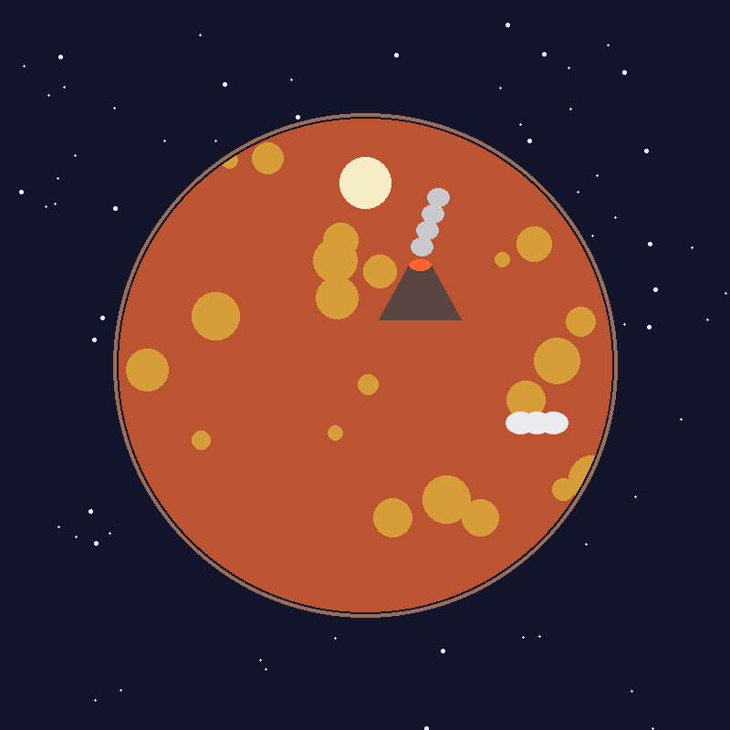

# 豆星 · 轻量平面微型世界沙盒

一颗扁平风格的小星球，每天北京时间 8:00 由 GitHub Actions 推演一天：
火山、河流、冰盖、月亮等非生物，与绒尾兔、玻璃鱼、跳跳菇、风铃树、小石人、荧光藻等生物，各自发生今日事件。

- `world.py`：推演与绘图（纯 Python + Pillow）
- `data/today.json`：今日数据（面板读取）
- `data/planet.png`：今日星球图
- `data/state.json`：世界持久状态（最近 30 天事件）

